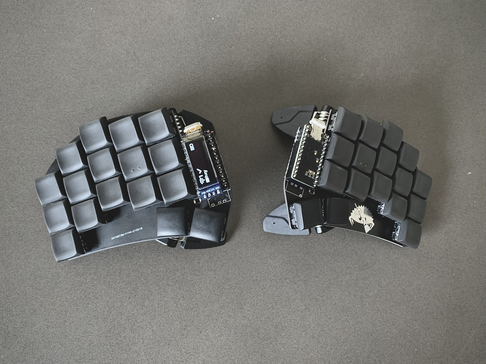
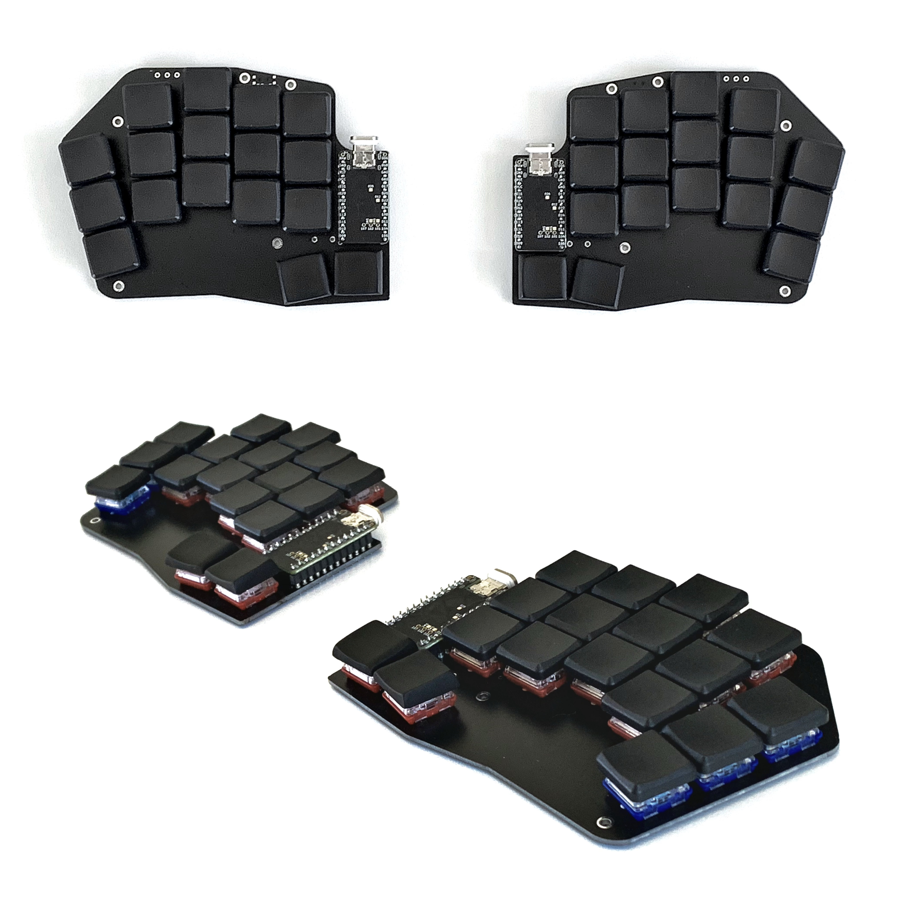

# zmk-config

My personal [ZMK firmware][3] configuration for my current 34-key wireless keyboards:

- [Sweep v2][12]
- [Hypergolic][1]

## Keymap

See [`config/cradio.keymap`](config/cradio.keymap) for a visualisation of the current keymap layout.

* [Colemak Mod-DH][8] layout on the base layer
* Simple thumb-activated layers for a numpad and a navigation cluster; each with sticky modifiers on the home row
* Symbols on base layer via one-handed combos (in [`combos.dtsi`](config/combos.dtsi))
* Macro-combos for symbol n-grams such as `()`, `--` and `` ``` `` (in [`macros.dtsi`](config/macros.dtsi))

I currently use the [`Makefile`](Makefile) to install a local ZMK environment via the [ZMK Docker images][10], apply my required patches/PRs, and then build and flash my `uf2` binaries to the nice!nano microcontrollers.

## Keyboards

### Sweep v2



* [Sweep v2][12] split keyboard PCB by @davidphilipbarr
* [nice!nano][2] wireless BLE microcontrollers with OLEDs directly attached
* splitkb.com Tenting Puck with Manfrotto MP3-BK pocket tripod
* [Kailh Choc low profile key switches][6]
  * White (50g, clicky)
  * Lighter-weight 30g springs installed
* [Chicago Stenographer keycaps][4] by @pseudoku

### Hypergolic



* [Hypergolic][1] split keyboard PCB by @davidphilipbarr
* [nice!nano][2] wireless BLE microcontrollers
* [Kailh Choc low profile key switches][6]
  * Red Pro (35g, linear)
  * gChoc on pinky columns (20g, linear)
* [MBK choc keycaps][5]

[1]: https://github.com/davidphilipbarr/hypergolic
[2]: https://nicekeyboards.com/nice-nano/
[3]: https://github.com/zmkfirmware/zmk
[4]: https://github.com/pseudoku/PseudoMakeMeKeyCapProfiles#chicago-stenographer
[5]: https://www.reddit.com/r/MechanicalKeyboards/comments/eq6vzs/gb_mbk_choc_lowprofile_keycaps_preorder_now/
[6]: http://www.kailh.com/en/Products/Ks/CS/
[7]: https://github.com/dxmh/34keymap
[8]: https://colemakmods.github.io/mod-dh/
[9]: https://precondition.github.io/home-row-mods
[10]: https://github.com/zmkfirmware/zmk-docker
[11]: https://noahfrederick.com/log/colemak-steno-hybrid-in-qmk
[12]: https://github.com/davidphilipbarr/sweep
